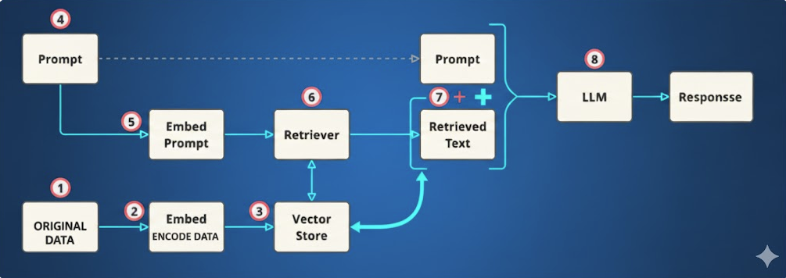
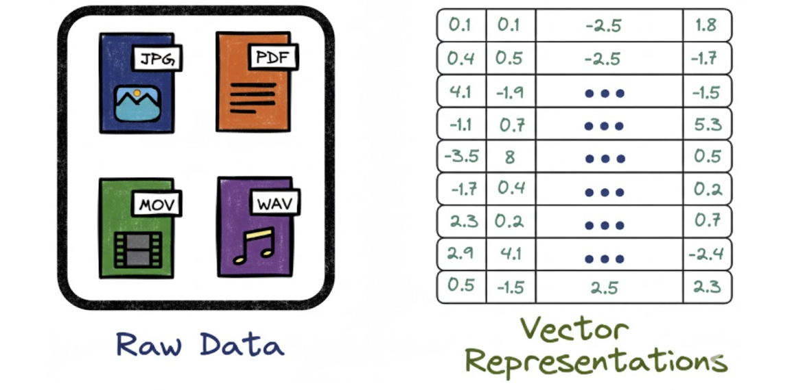
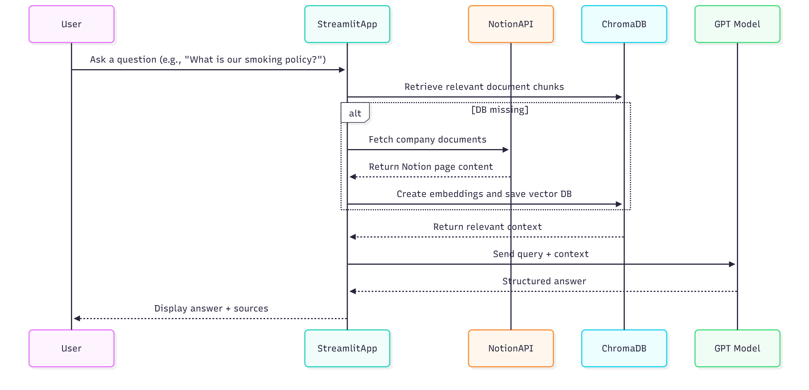
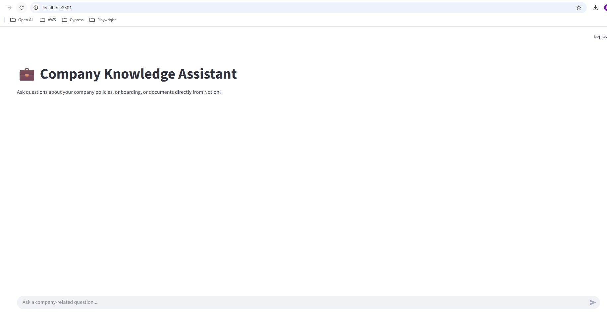

<div align="center">

# 💼 Vector Search with RAG

A lightweight RAG system that pulls content from Notion, builds a vector database with Chroma, and answers questions using GPT.


</div>

#  Vector Search with RAG

A lightweight tool that connects to Notion, pulls in your company docs—like Onboarding Process, Meeting Policy, or Work-From-Home Guidelines—and transforms them into a searchable vector database using Chroma.

Employees can then ask questions in a friendly Streamlit chat interface:

“How do I request vacation time?”
“What’s our meeting-free Friday policy?”
“Where do I find the onboarding checklist?”
"Can you please code function of the new functionality for Impressions on Budget page ?"

The system understands natural language and instantly surfaces the right information from your internal guides and policies—no more digging through your comopany's confluence pages, github repos or Notion tabs.

---

## 📘 Table of Contents
- [ Chapter 1 — What Is RAG?](#-chapter-1--what-is-rag)
- [ Chapter 2 — What Is a Vector Database?](#-chapter-2--what-is-a-vector-database)
- [ Chapter 3 — What This Project Does](#-chapter-3--what-this-project-does)
- [ Chapter 4 — Setup and Installation)](#-chapter-4--setup-and-installation)
- [ Chapter 5 — Run the Application](#-chapter-5--run-the-application)

---


# Chapter 1 — What Is RAG?

**RAG (Retrieval-Augmented Generation)** is a method where an AI model like GPT:

- **Retrieves** information from your own documents  
- **Generates** an answer based on that information  

This makes answers accurate, up-to-date, and grounded in your real data.

###  Example

**Without RAG:**  
“What's our leave policy?”  
→ GPT may guess or hallucinate because it has no idea what exact conext you are talking about.

**With RAG:**  
GPT finds the right text from your company documents and answers based on that.



Here is the detailed concept for RAG : [RAG and its concepts](./docs/03_RAG_concept.md)

---

# Chapter 2 — What Is a Vector Database?

A vector database stores text as **embeddings** — mathematical representations of meaning.  
This allows the system to search by *meaning*, not keywords.


### Simple Example

```python
from langchain_openai import OpenAIEmbeddings
from langchain_community.vectorstores import Chroma

embeddings = OpenAIEmbeddings(model="text-embedding-3-large")
texts = ["21 days annual leave", "Smoking is not allowed indoors"]

db = Chroma.from_texts(texts, embeddings)
results = db.similarity_search("What is the smoking rule?")
print(results[0].page_content)
```




Here is the detailed concept for Vecotr database : [Vector databases and Metadata filtering](./docs/02_vector_database.md)

---

# Chapter 3 — What This Project Does

This project connects directly to your Notion pages (such as **Company Policy** or **Onboarding Process**) using the Notion API.  
It then generates embeddings, stores them in a vector database, and provides an interactive **Streamlit chat interface** for querying your knowledge base.

---

##  Features

- Connects to live Notion content via API  
- Automatically builds and updates a vector database  
- Produces structured, well-formatted answers using GPT  
- Clean and intuitive Streamlit chat interface  
- Easy to deploy — runs with a single command

## Project Architecture


<div style="font-family: Arial, sans-serif;">

  <div style="
      padding: 10px 20px;
      border: 2px solid #4a90e2;
      border-radius: 8px;
      display: inline-block;
      margin-bottom: 6px;
      font-weight: bold;
  ">
    User
  </div>

  <div style="font-size: 20px; text-align: center;">↓</div>

  <div style="
      padding: 10px 20px;
      border: 2px solid #4a90e2;
      border-radius: 8px;
      display: inline-block;
      margin-bottom: 6px;
      font-weight: bold;
  ">
    Streamlit App (query_engine.py)
  </div>

  <div style="font-size: 20px; text-align: center;">↓</div>

  <div style="
      padding: 10px 20px;
      border: 2px solid #4a90e2;
      border-radius: 8px;
      display: inline-block;
      margin-bottom: 6px;
      font-weight: bold;
  ">
    Vector DB (Chroma)
  </div>

  <div style="font-size: 20px; text-align: center;">↓</div>

  <div style="
      padding: 10px 20px;
      border: 2px solid #4a90e2;
      border-radius: 8px;
      display: inline-block;
      margin-bottom: 6px;
      font-weight: bold;
  ">
    LLM (GPT-4 / GPT-5)
  </div>

  <div style="font-size: 20px; text-align: center;">↓</div>

  <div style="
      padding: 10px 20px;
      border: 2px solid #4a90e2;
      border-radius: 8px;
      display: inline-block;
      margin-bottom: 6px;
      font-weight: bold;
  ">
    Structured, Sourced Answer
  </div>

</div>
<br></br>


Here is a detailed Sequence diagram fo how the workflow looks like in the app level :-



---

# Chapter 4 — Setup & Installation

Follow these steps to get the app running from scratch.


### Prerequisites

Make sure you have the following:

- **Python 3.10+**  
  Check your version with:  
  ```bash
  python --version
  ```

- Access to **Open AI** API key . In case you dont have one, create an API key from your OpenAI dashboard.
```
Login to Open AI -> https://platform.openai.com/settings/profile/api-keys

Click "+ Create a new secret key" -> Name your key for e.g.:- "My demo key" -> Copy the generated key 

This key will be used to be pasted in .env file
```
In the project root, create a .env file and this one line **( Just replace "sk-your-key-here" with your generated key , just paste it as it is no need to use "")**:
```
OPENAI_API_KEY=sk-your-key-here
```
Tip: Never commit your key. .env is git-ignored.

---

### Prerequisites --  Integration with Notion Documents 

I have already provided some demo documents which you can use for this app. Please follow the following link to setup your account ( in case you don't have one ) and integrate with the documents. 

[Notion Setup](./docs/01_notion_setup.md)


Note : You can use Confluence links if in case you have access to ( In case your company would probably agree to use this project )
---

### Clone the Repository

Run the following commands:

```bash
git clone https://github.com/PaurushVishnoi/rag-smart-search.git
cd rag-notion-app
```
---

### Install Dependencies

From the project root, install all required packages:

```bash
pip install -r requirements.txt
```

This will install:

- Notion client
- LangChain + Chroma
- Streamlit
- OpenAI integration
- python-dotenv and other 

---

### Create the .env File

In the project folder, i.e. after you clone the root folder will be /rag-smart-search, create a file named .env and add the following content:

```env

OPENAI_API_KEY=sk-xxxxxxxxxxxxxxxxxxxxxxxx # ( your generated Open AI api key )
NOTION_TOKEN=ntn_xxxxxxxxxxxxxxxxxxxxxxxxx #( your generated Notion Integration id )
ROOT_PAGE_ID= xxxxxxxxxxxxxxxxxxxxxxxxxxxx #( your generated Root page ID  )
```

# Chapter 5 — Run the Application

Start the Streamlit app:

```bash
streamlit run query_engine.py
```

On the first run, the app will:

- Detect that no vector database exists yet (the `db/` folder is empty or missing)
- Connect to Notion using:
  - `NOTION_TOKEN`
  - `ROOT_PAGE_ID`
- Fetch all child pages (e.g., Company Policy, Onboarding Processes, etc.)
- Chunk the text and generate embeddings
- Create a local vector database under `./db`
- Launch the web UI in your browser

You should see something like:



### Ask Your First Question

In the chat input at the bottom, try questions like:

- *What is our smoking policy?*  
- *How can I apply for annual leave?*  
- *What is the onboarding process for a new employee?*

The app will:

- Retrieve relevant chunks from your Notion content (via the vector database)
- Pass them to GPT using a structured prompt
- Return a clean, structured answer
- Display **Sources** (e.g., company policy, onboarding process, etc.)

### Rebuilding / Updating the Knowledge Base (Optional)

If you update your Notion pages and want to refresh the knowledge base, you have two options:

#### **Option A — Rebuild manually**
Run the builder script:

```bash
python rag_builder.py
```

#### **Option B — Delete the db/ folder and just run the app again:**

```bash
rm -rf db streamlit run query_engine.py
```

The app will rebuild the database automatically on startup.