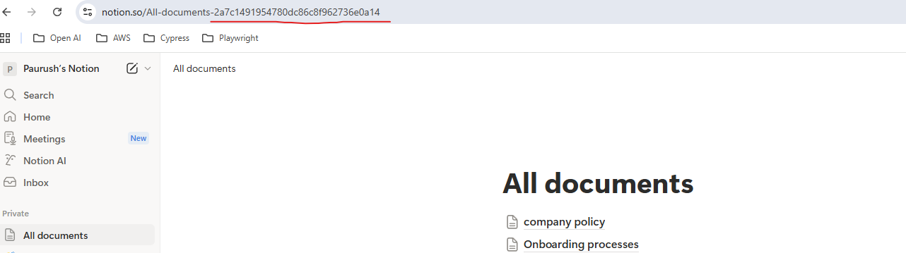
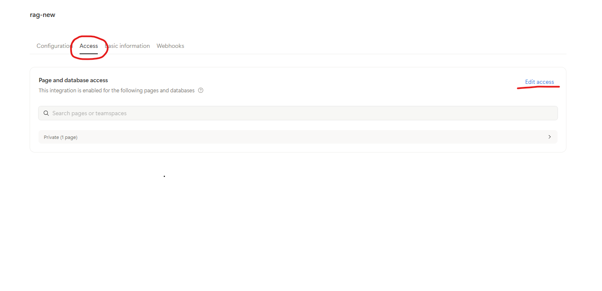
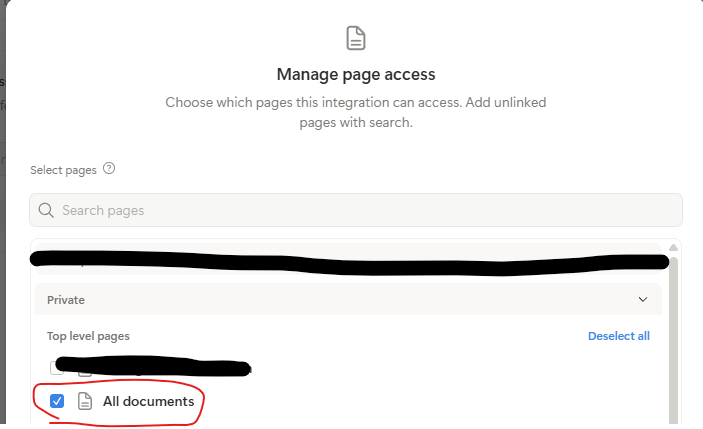

## Complete Notion Setup Guide (For First-Time Notion Users)

This chapter will help anyone — even someone who has **never used Notion** — get set up so the app can read your public Notion page.

---

### Step 1 — Access the Public Notion Page

Your root company documents page is public:

 **https://www.notion.so/All-documents-2a7c1491954780dc86c8f962736e0a14**

Anyone can:

- Open it  
- View its content  
- Access the **Company Policy** and **Onboarding Processes** subpages  

However, **public access is NOT enough** for the Notion API.

The Notion API requires:

- An **Integration Token**
- Explicit **permissions** to access the pages  

**Every user must create their own Notion integration.**

---

### Step 2 — Create a Notion Account (if you don’t have one)

Even though the page is public, the API only works with authenticated users.

1. Go to **https://www.notion.so**
2. Sign up using:
   - Email  
   - Google  
   - Apple ID  
3. A new workspace will be created for you.  

Create a new page named "All Documents"

Note : this will be your `ROOT_PAGE_ID` which you will use in the `.env` file 



Create two new pages 

1. "company policy" and copy the content https://www.notion.so/company-policy-2a7c1491954780edb7aef79cae25438d
2. "Onboarding process" and copy the content https://www.notion.so/Onboarding-processes-2a7c149195478053ab29dcb72e5a6566

---

### Step 3 — Create a Notion Integration (required for API access)

1. Open: **https://www.notion.so/my-integrations**
2. Click **+ New integration**
3. Give it a name, e.g.:

```bash
Company RAG Assistant
```


4. Under **Capabilities**, select **Read content**
5. Click **Submit**
6. Copy your **Internal Integration Token**

This token becomes your `NOTION_TOKEN` in the `.env` file.


### Step 4 — Add Your Integration to the Public Page

This is the **most important step**.

Even though the page is public, the Notion API **cannot** read public pages unless you explicitly **share the page with your integration**.

To do this:

Go to your created Integration Access tab



Give the access to your page created.




You’re **not** sharing the page with a person —  
you’re sharing it with your **internal API integration**.

Once done, your integration will have access to:

- The root **All documents** page  
- All its subpages (e.g., Company Policy, Onboarding Processes, etc.)

### Step 5  — Test Your Access

To quickly test the connection, create a **test.py** with following code in your folder and run it :

```python
from notion_utils import get_all_child_pages, ROOT_PAGE_ID

print(get_all_child_pages(ROOT_PAGE_ID))
```

✅ You are good to go !!!!